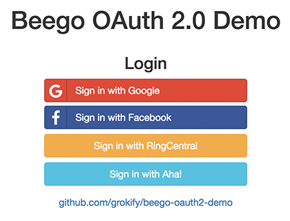
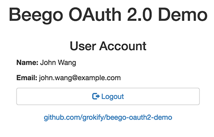

# Beego OAuth 2.0 Demo

[![Build Status][build-status-svg]][build-status-url]
[![Go Report Card][goreport-svg]][goreport-url]
[![Docs][docs-godoc-svg]][docs-godoc-url]
[![License][license-svg]][license-url]

A [Beego](https://beego.me/) example app to demo OAuth 2.0 using Google and Facebook. 





The following are used in this example app:

* OAuth 2.0
  * [`oauth2`](https://github.com/golang/oauth2)
  * [`goauth`](https://github.com/grokify/goauth)
* Rendering
  * [Bootstrap](http://getbootstrap.com/)
  * [Font Awesome](http://fontawesome.io/)
  * [Social Buttons](https://lipis.github.io/bootstrap-social/)
  * [Quicktemplate](https://github.com/valyala/quicktemplate)

## Usage

### App Hostname / OAuth 2.0 Redirect URI

Decide on the hostname for your app which will be used in the OAuth 2.0 URI.

The redirect URI is `oauth2callback`. For example, if your app URL is `https://example.com`, your redirect URI will be `https://example.com/oauth2callback`.

If you do not have an Internet accessible hostname, you can use [ngrok](https://ngrok.com/) for testing.

### Configure Google and Facebook

Login to the Google and Facebbook developer consoles to configure your apps with your OAuth 2.0 rediect URIs. During this process, you will get your OAuth 2.0 client ID and client secrets for Google and Facebook.

### Install & Configure App

1. Clone the repo
2. Install the dependencies
3. Set up your `app.conf` file.
4. Run the app

You can do the above with the following steps. See the next section for more detailed information on the configuration file.

```bash
$ git clone https://github.com/grokify/beego-oauth2-demo
$ go get ./...
$ cd beego-oauth2-demo/conf
$ cp app.conf.sample app.conf
$ vim app.conf
$ bee run
```

#### Configuration File

This is a basic Beego config file with additional properties. Specifically, it has the following 3 properties:

| Property | Description |
|----------|-------------|
| `oauth2redirecturi` | This app's OAuth2 redirect URI which has the path `/oauth2callback`, e.g. `https://example.com/oauth2callback` |
| `oauth2configgoogle` | The [Google Developers Console](https://console.developers.google.com/) `client_credentials.json` file information. Nagivate to "API Manager" > "Credentials" > "OAuth 2.0 client IDs" > <Your Credential> > "Download JSON". This is read directly by OAuth2's `google.ConfigFromJSON()` function. |
| `oauth2configfacebook` | This uses the format used by `oauth2.Config` |

## References

### Google Auth Credentials

App credentials are created an managed using the [Google Developers Console](https://console.developers.google.com/). To create an app, do the following:

1. Navigate to [Google Developers Console](https://console.developers.google.com/)
1. Click "API Manager"
1. Create / Select a Project
1. Click "Credentials"
1. Create / Select OAuth 2.0 client IDs for "Web application"
1. Click "Download JSON"

 [build-status-svg]: https://github.com/grokify/beegoutil/actions/workflows/ci.yaml/badge.svg?branch=master
 [build-status-url]: https://github.com/grokify/beegoutil/actions/workflows/ci.yaml
 [lint-status-svg]: https://github.com/grokify/beegoutil/actions/workflows/lint.yaml/badge.svg?branch=master
 [lint-status-url]: https://github.com/grokify/beegoutil/actions/workflows/lint.yaml
 [goreport-svg]: https://goreportcard.com/badge/github.com/grokify/beegoutil
 [goreport-url]: https://goreportcard.com/report/github.com/grokify/beegoutil
 [docs-godoc-svg]: https://pkg.go.dev/badge/github.com/grokify/beegoutil
 [docs-godoc-url]: https://pkg.go.dev/github.com/grokify/beegoutil
 [license-svg]: https://img.shields.io/badge/license-MIT-blue.svg
 [license-url]: https://github.com/grokify/beegoutil/blob/master/LICENSE
